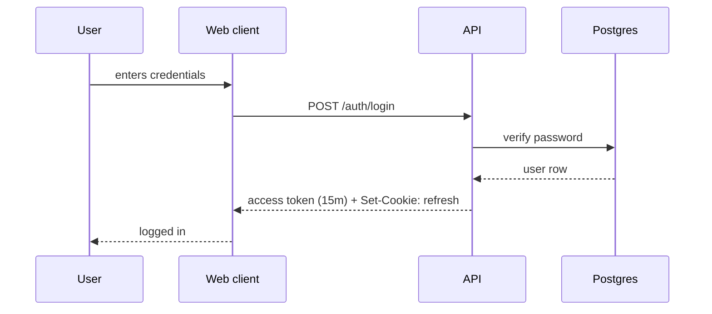

# Authentication architecture

Authentication uses short-lived access tokens (15 min) and rotating refresh tokens stored in HTTP-only cookies. The web client never sees the refresh token; refresh happens via a same-origin endpoint.

## Flow

## Refresh

When the access token expires, the client calls `POST /auth/refresh`. The server validates the refresh cookie, rotates it, and returns a new access token. If the refresh cookie is missing or invalid, the user is logged out.

## Storage

| What             | Where                  | TTL               |
| ---------------- | ---------------------- | ----------------- |
| Access token     | In-memory (web client) | 15 min            |
| Refresh token    | HTTP-only cookie       | 30 days, rotating |
| Session metadata | `sessions` table       | Until logout      |

## Why short-lived access tokens?

Limits the blast radius of a leaked access token. Refresh tokens are server-side trackable and revocable individually.
