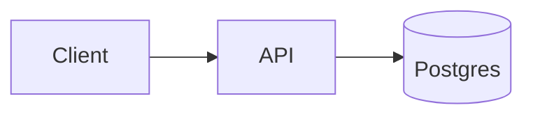

# /set-documentation

You are doing a **first-time deep read** of the codebase to generate the complete documentation set under `DOKAI/`. This is the _create_ command — comprehensive, exhaustive, one-shot. After this runs, the project should have a fully populated documentation tree and/or OpenAPI specs, depending on scope.

## When to use this vs `/update-documentation`

| Situation                                                                                               | Command                                          |
| ------------------------------------------------------------------------------------------------------- | ------------------------------------------------ |
| `DOKAI/` is empty, or only has the init stubs (`index.md`, `architecture/overview.md`, `_section.json`) | **`/set-documentation`** ← you're here           |
| `DOKAI/` already has substantial content and you want to refresh after code changes                     | `/update-documentation`                          |
| You want to find what's not documented and fill the gaps                                                | `/update-documentation` (it covers gap analysis) |

If you find that `DOKAI/` already has 5+ non-stub docs with substantive content, **stop and recommend the user run `/update-documentation` instead**. This command would risk overwriting prose the user has already curated.

## Step 0 — Choose scope

Unless `$ARGUMENTS` already names a scope (e.g. "api", "docs", "frontend only"), use the **AskUserQuestion** tool with `multiSelect: true` to ask what to generate. Present exactly two options:

- **Docs** — the `DOKAI/` markdown documentation tree (architecture, features, packages, etc.)
- **API endpoints** — OpenAPI specs under `DOKAI/openapi/` derived by reading the repo's routes, controllers, and handlers

Both options are **selected by default**. The user may uncheck one to limit the run to a single scope.

Proceed with whatever the user keeps checked. If `$ARGUMENTS` contains an unambiguous scope word ("docs", "api", "openapi", "markdown", etc.), infer the scope and skip the question.

---

## Docs scope — Workflow A (first-time doc authoring)

_Run this section only if **Docs** is in scope._

### Step 1 — Detect repository shape

Read these to determine the layout:

- Root `package.json` and `pnpm-workspace.yaml` / `package.json#workspaces`
- `turbo.json` (if present)
- Lockfile (`pnpm-lock.yaml`, `package-lock.json`, `yarn.lock`, `bun.lockb`)
- Top-level folders: `apps/`, `packages/`, `services/`, `tooling/`

Classify the repo as one of:

- **Normal** — single package, no workspaces.
- **Workspaces** — pnpm/npm/yarn workspaces, no Turborepo.
- **Turborepo** — `turbo.json` present.
- **Monorepo (non-Turbo)** — workspaces + custom orchestration.

### Step 2 — Read the codebase deliberately and exhaustively

This is a _deep_ read. Don't sample — read every file that informs how the system works. Skip:

- `node_modules/`, `dist/`, `build/`, `.turbo/`, `.vite/`, `.next/`, `coverage/`, `.dokai/`
- Lockfiles, generated code, large fixtures
- Anything matching `.gitignore`

Look for and understand:

- **Entry points** — `main`, `bin`, `index.*`, `app.*`, top-level routers
- **Public APIs** — exported modules, REST/GraphQL endpoints, RPC handlers, CLI surfaces
- **Data layer** — schemas, migrations, ORM models, query patterns
- **Auth & sessions** — login flows, token issuance, permission models
- **Build/release** — `turbo.json` pipelines, GitHub Actions, npm scripts
- **Testing** — frameworks, fixtures, conventions
- **Workspace topology** (monorepos) — which packages depend on which
- **Configuration** — env vars, feature flags, settings shape
- **Side-effecting integrations** — message queues, cron jobs, external services

You should be able to explain the project end-to-end before you write a single doc. If something is unclear after reading, mark it as `TBD: <question>` in the doc rather than fabricating an answer.

### Step 3 — Plan the documentation tree

Group docs by **logical product, package, feature, service, or domain** — not by mirroring folders 1:1.

Look at `DOKAI/_section.json` and any seeded `_section.json` files first. Their `title`, `tags`, `order` set the conventions. Match them when adding new sections.

For monorepos and Turborepos, create one section per workspace package that warrants documentation:

```
DOKAI/
├── _section.json                       (seeded — keep)
├── index.md                            (seeded — replace stub content)
├── architecture/
│   ├── _section.json                   (seeded — keep)
│   ├── overview.md                     (seeded — replace stub content)
│   ├── data-flow.md                    (new)
│   └── deployment.md                   (new)
├── apps/
│   └── <app-name>/
│       ├── _section.json               (new — title, tags, order)
│       ├── overview.md
│       └── ...
├── packages/
│   └── <package-name>/
│       ├── _section.json
│       ├── overview.md
│       ├── api.md
│       └── ...
└── services/
    └── <service-name>/
        ├── _section.json
        ├── overview.md
        └── endpoints.md
```

For normal repos, use feature/domain folders:

```
DOKAI/
├── _section.json                       (seeded — keep)
├── index.md
├── architecture/
├── frontend/
│   ├── _section.json
│   └── components.md
├── backend/
│   ├── _section.json
│   └── api.md
└── workflows/
    ├── _section.json
    └── release.md
```

Keep each file focused. Multiple smaller docs beat one massive file. Aim under ~600 lines per file.

### Step 4 — Write each document with required frontmatter

Every markdown file in `DOKAI/` MUST start with:

```yaml
---
title: <short, sentence-cased title>
description: <one-line summary, ~100 chars>
tags: [<area>, <subsystem>, ...]
version: 0.1.0
status: draft
createdAt: <ISO 8601>
updatedAt: <ISO 8601>
---
```

Statuses: `draft`, `review`, `stable`, `deprecated`, `archived`. New docs start as `draft`.

When adding a new section folder, also add a `_section.json` with the same shape as seeded ones:

```json
{
  "title": "Frontend",
  "description": "Frontend application architecture.",
  "tags": ["frontend"],
  "version": "0.1.0",
  "order": 2
}
```

### Step 5 — Add Mermaid diagrams where they add real value

Use Mermaid for:

- **Architecture diagrams** (`flowchart`, `graph`)
- **Sequence diagrams** for request flows, auth flows, async pipelines
- **Dependency / module graphs** (especially for monorepos)
- **Turborepo pipeline graphs** when build dependencies matter
- **Data model relationships** (`erDiagram`)

Don't add diagrams for things plain prose explains better. Aim for diagrams that survive future refactors.

````

````

### Step 6 — Configure DOKAI settings

Update `DOKAI/settings.json` (committed) with the project name, repository type, and feature flags. Init has already seeded sane defaults; only edit fields that need to change based on what you read.

Do **not** create or modify `DOKAI/user-settings.local.json` — it is per-user and gitignored.

For monorepos and Turborepos with workspace-mapped sections, set `repository.structure: "workspace-mapped"`.

### Step 7 — Replace the seeded stubs

The seeded `index.md` and `architecture/overview.md` contain placeholder text. Once you have a real understanding of the project, rewrite them:

- `index.md` — landing-page summary: what this project is, how the docs are organized, how to get started.
- `architecture/overview.md` — system overview: components, data flow, key invariants. Include a Mermaid diagram of the high-level architecture.

---

## API scope — Author OpenAPI specs from code

_Run this section only if **API endpoints** is in scope._

Author OpenAPI 3.x specifications under `DOKAI/openapi/` by reading the repo's actual routes, controllers, and handlers. Do not invent endpoints or field shapes. Follow the `dokai-api` skill (`.claude/skills/dokai-api/SKILL.md`) for the full conventions; the steps below are a checklist.

### API Step 1 — Locate all routes

Find every router/controller file:

- Express: `router.get(...)`, `app.post(...)`, etc.
- NestJS: `@Controller`, `@Get`, `@Post`, etc.
- Fastify: `fastify.route(...)`, `fastify.get(...)`, etc.
- tRPC / GraphQL resolvers: list procedures / mutations / queries.

List every path and HTTP method (or procedure name for tRPC/GraphQL).

### API Step 2 — Read handlers for shapes

For each route, read the handler to understand:

- Request body shape (JSON fields, types, required vs optional)
- Path parameters and query parameters (names, types, constraints)
- Response shape — happy path body and status code
- Error response codes and shapes
- Auth guards or middleware applied to the route

### API Step 3 — Identify security schemes

Find auth middleware, guards, or decorators that protect routes. Translate to `components.securitySchemes` entries (e.g. `bearerAuth` with `scheme: bearer`, `apiKeyAuth` with `in: header`, OAuth2 flows). Apply `security` globally and override for public routes.

### API Step 4 — Write the spec file

Place the spec at `DOKAI/openapi/<name>.yaml` (use `api.yaml` for a single-surface project; split by service name for independent services). Structure:

```yaml
openapi: "3.1.0"
info:
  title: <Project Name> API
  version: "0.1.0"
servers:
  - url: <base URL — TBD: confirm from env config if unclear>
components:
  securitySchemes: { ... }
  schemas: { ... }   # use $ref throughout; name schemas after domain concepts
security:
  - <scheme>: []
paths:
  /resource:
    get:
      summary: ...
      parameters: [...]
      responses:
        "200":
          content:
            application/json:
              schema:
                $ref: "#/components/schemas/Resource"
```

Mark anything you cannot confidently infer as `TBD: <question>` in the relevant `description` field. A spec with honest gaps is more useful than a confident wrong one.

### API Step 5 — Mark gaps and confirm placement

List every `TBD` you wrote so a human can resolve them. Confirm the file is placed under `DOKAI/openapi/` and will be picked up automatically by the DOKAI UI.

---

## Output

Write all files directly — do not paste content in chat. After completion, list:

1. **Files created** — grouped by scope (Docs section / API spec).
2. **Files replaced** — only the seeded stubs for Docs; flag any non-stub overwrite explicitly so the user can review.
3. **Open questions / `TBD` markers** — things you could not infer (owners, deployment targets, secret names, uncertain field types, etc.).
4. **Scopes run** — which of Docs / API endpoints was executed.
5. **Suggested next steps** — typically: review the drafts in the editor (`pnpm dokai`), tighten the prose, run `/update-documentation` whenever code changes.
